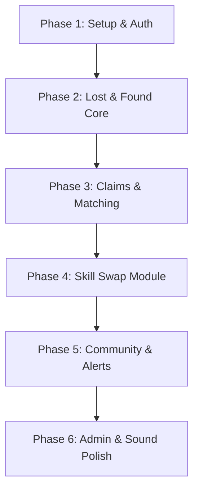

# Campus Connect — Phased Development Roadmap

This directory contains the sequential, phase-by-phase development instructions for building **Campus Connect** — a digital notice board featuring Lost & Found, Skill Swap, and Community features built with Next.js, Tailwind CSS, and Supabase.

---

## 📅 Roadmap Overview

To ensure a smooth building process without dependency loops, follow the phases in numeric order. Each file includes detailed requirements, database schemas, API setups, styling indicators, and concrete testing checklists.

---

## 🗂️ Table of Contents & Phase Summary

### 🔑 [Phase 1: Project Setup, Design Tokens & Auth](file:///c:/Users/Sumanth%20Murari/Documents/campus-connect/development-phases/phase-1-setup-and-auth.md)
*   **Goal:** App bootstrapping, design system token integration, and login gateway configuration.
*   **Key Tasks:** Next.js + Tailwind configuration, Google Font imports, Supabase Server-Side Rendering (SSR) cookie setup, `profiles` database table trigger creation, middleware page guards, registration, login flows, and avatar upload onboarding.

### 🔍 [Phase 2: Lost & Found Core Features](file:///c:/Users/Sumanth%20Murari/Documents/campus-connect/development-phases/phase-2-lost-and-found-core.md)
*   **Goal:** Implement card-posting lists and metadata tags for lost or found items.
*   **Key Tasks:** `lost_found_items` schema migration, drag-and-drop client compressed uploader, dynamic listing cards with irregular layout offsets, category/location tags filtering, and inline SVG QR code generators.

### 🧵 [Phase 3: Claim Verification & Smart Matching](file:///c:/Users/Sumanth%20Murari/Documents/campus-connect/development-phases/phase-3-claims-and-matching.md)
*   **Goal:** Claim validation workflows, smart matches triggers, and red string connections.
*   **Key Tasks:** `claims` verification schemas, security questionnaires, finder dashboards, approval stamps actions (+20 reputation point triggers), proximity algorithm matches, and reactive catenary SVG Red String connections.

### 🤝 [Phase 4: Skill Swap Module](file:///c:/Users/Sumanth%20Murari/Documents/campus-connect/development-phases/phase-4-skill-swap.md)
*   **Goal:** Build the peer-to-peer barter learning system, scheduler, and real-time chat.
*   **Key Tasks:** `skills`, `swap_matches`, `sessions`, `chat_messages`, and `ratings` schemas. Implement scheduling (rescheduling, ICS calendar invites), real-time chat with attachment uploads, rating surveys, and reputation math triggers (+15 completion / +10 five-star tutor badge).

### 💬 [Phase 5: Community Features & Notification Engine](file:///c:/Users/Sumanth%20Murari/Documents/campus-connect/development-phases/phase-5-community-and-notifications.md)
*   **Goal:** Discussions feeds, resource databases, and notification channels.
*   **Key Tasks:** `posts`, `comments` (2-level threads), and `post_reactions` schemas. Build Q&A solve streaks overlays, custom post reactions (heart, pin overlays), global real-time notification listener tags, and Resend email integrations.

### 🛡️ [Phase 6: Admin Dashboard & Skeuomorphic Polish](file:///c:/Users/Sumanth%20Murari/Documents/campus-connect/development-phases/phase-6-admin-and-polish.md)
*   **Goal:** Back-end dashboards analytics, moderation, skeuomorphic audio alerts, and accessibility controls.
*   **Key Tasks:** `moderation_reports` systems, webcam QR hand-off scans override, Web Audio API sound sprite controllers (thock, tear, plucks, thud), ambient daylight clock overrides, reduced-motion fallback safety, and Vercel launch audits.

---

## 🛠️ How to Develop with this Roadmap

1.  **Read the Specifications First:** Ensure you review the parent [design.md](file:///c:/Users/Sumanth%20Murari/Documents/campus-connect/design.md) file to understand visual tokens, clips, animations, and typography structures.
2.  **Examine Phase Prerequisites:** Do not skip phases. For example, Phase 3 relies heavily on the `lost_found_items` data structures created in Phase 2.
3.  **Run Verification Checklists:** At the bottom of each phase document, you will find a verification checklist. Ensure every item works in your local environment before proceeding to the next file.
4.  **Use with AI Agents:** You can feed these phase files one-by-one to your AI coding agent as contextual prompts to generate specific features and layouts sequentially.
